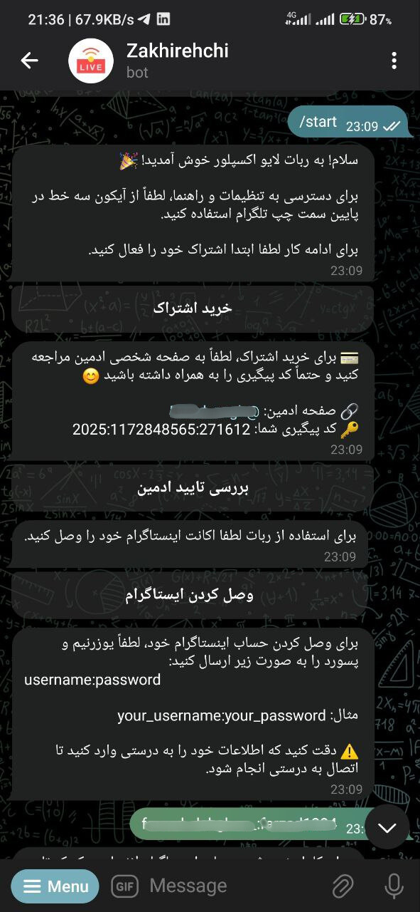

# 📺 InstaLive Explorer

A Telegram-integrated tool for discovering and watching Instagram Live videos.  
Built as a collaborative project with friends, this system uses a Telegram bot for user interaction and subscription management, a backend service, a web-based frontend, and a crawler that fetches live Instagram streams.

## 📌 Project Overview

This project is designed to help users discover ongoing Instagram Live sessions through a Telegram bot interface, and seamlessly direct them to watch lives directly on Instagram.

The system is divided into four main parts:

### 1️⃣ Telegram Bot (by [@Farzad Dehghan](https://github.com/farzaddm))

- Built with `python-telegram-bot`
- Handles user subscriptions
- Allows users to sign in with their Instagram accounts
- Provides an interactive menu to explore live streams
- Includes an admin panel for managing users and settings
- Check the authentication and data storage using `PostgreSQL`

### 2️⃣ Backend (by [@Supernova](https://github.com/supernova-Z313))

- Developed with `Node.js`
- Manages API requests and data storage using `PostgreSQL`

### 3️⃣ Instagram Live Crawler (by [@Supernova](https://github.com/supernova-Z313))

- Node.js service that scrapes Instagram for active live sessions
- Sends available live stream data to the backend and Telegram bot
- Monitors users' Instagram accounts for potential issues or verification needs

### 4️⃣ Frontend (by [@mohammad_hosein_pakdaman](https://github.com/mohammadhosein-p))

- Built using `React`
- Web interface for users to browse live streams
  - Displays a screenshot and basic information about the streaming account
  - Links users to Instagram if they are interested in the stream
- Allows users to like streams or add streams/accounts to their blacklist
  - Filters live streams based on user preferences

## 🖼️ UI Screenshots

### 🌐 Web UI  
<p float="left">
  
</p>

### 💬 Telegram Bot  
<p float="left">
  
  
</p>

## 📦 Technologies Used

- Python (python-telegram-bot)
- Node.js
- React
- PostgreSQL

## 🚀 Installation

1. **Clone the repository**

   ```bash
   git clone git remote add origin https://github.com/farzaddm/Instalive_Explorer.git
   cd instalive-explorer
   ```

2. **Setup environment variables**

   - Create a `.env` file in the `/bot` for the Telegram bot with:
     ```
     TELEGRAM_TOKEN=your-telegram-bot-token
     ADMIN_USERNAME=your_admin_username
     ADMIN_PASSWORD=your_admin_password
     ADMIN_PV=your_admin_telegram_id
     FRONTEND_URL=your_frontend_link
     JWT_SECRET=your_jwt_secret
     DATABASE_URL=your_postgres_url
     ```

   - Create a `.env` file in the `/backend` ans `/scrawler` with:
     ```
     JWT_SECRET=your_jwt_secret
     DATABASE_URL=your_postgres_url
     ```

3. **Install dependencies for each part**

   - Navigate into each folder (`/bot`, `/backend`, `/crawler`, `/frontend`) and follow respective `README` or installation instructions inside those directories.

4. **Run the services**

   - Start the Telegram bot:
     ```bash
     cd bot
     python3 bot.py
     ```
   - Start the Backend service:

     ```bash
     cd backend
     npm install
     npm start
     ```

   - Start the Instagram Live Crawler:

     ```bash
     cd crawler
     npm install
     npm start
     ```

   - Start the Frontend application:
     ```bash
     cd frontend
     npm install
     npm run dev
     ```
     ⚠️ In real-world deployment, you should probably not run this with npm run dev on a laptop while sipping coffee ☕. Use proper DevOps magic—like configuring Nginx or Apache, using PM2 or Docker, and setting up CI/CD pipelines for extra coolness 😎.

## 🗃️ Database Schema
Here’s the simplified structure of the main tables used:


You can find the sql code for creating tables in `sql/create_tables.sql`.


## 👥 Contributors

- [@Farzad Dehghan](https://github.com/farzaddm) – Telegram Bot Developer
- [@Supernova](https://github.com/supernova-Z313) – Backend & Crawler Developer
- [@mohammad_hosein_pakdaman](https://github.com/mohammadhosein-p) – Frontend Developer

## 📄 Note

This project was originally built as a commercial project. Due to unforeseen issues with the client, it’s now open as a personal showcase and portfolio piece.
